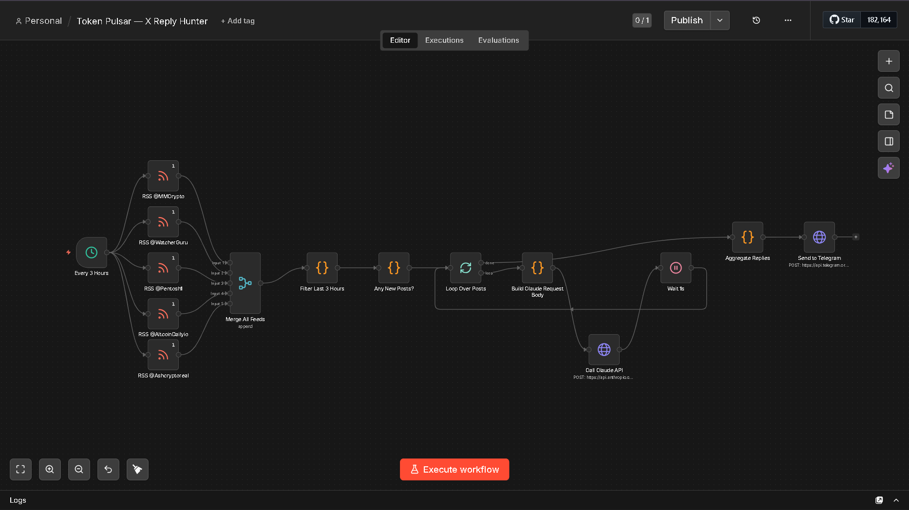
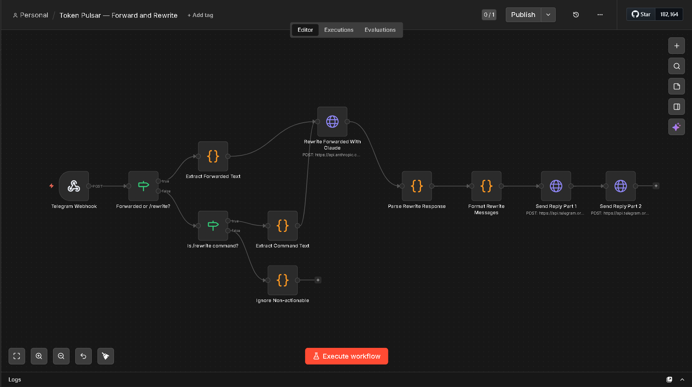
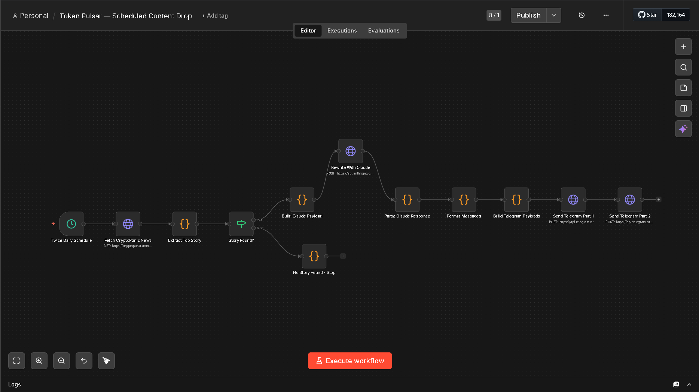
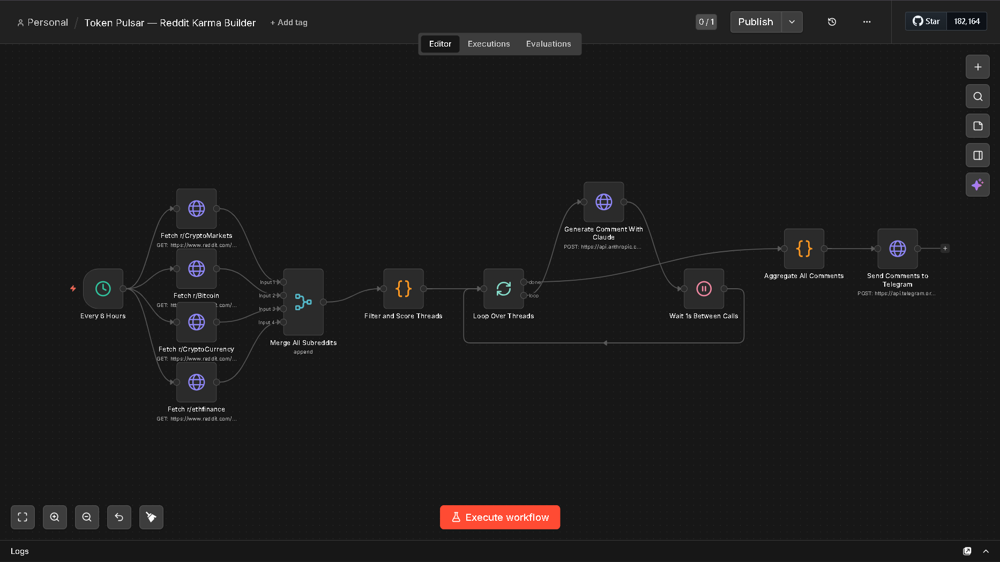

# 🤖 Token Pulsar — Autonomous Crypto Influencer System

> A fully automated crypto content engine powered by n8n and Claude AI

---

## Overview

Token Pulsar is a **4-workflow n8n automation system** that acts as a fully autonomous crypto influencer. It monitors real-time signals from RSS feeds, Reddit, and news APIs — then uses the **Claude API** to generate, rewrite, and distribute content to a Telegram channel on autopilot.

No manual posting. No copy-pasting. Just set it and let it run.

---

## Workflows

### 1. 🔍 X Reply Hunter
Monitors 5 crypto influencer RSS feeds every 3 hours (`@MMCrypto`, `@WatcherGuru`, `@Pentosh1`, `@AltcoinDailyio`, `@Ashcryptoreal`), filters for new posts, loops over each one, builds a Claude prompt, and sends AI-generated replies to Telegram.

**Flow:** `Every 3h → Merge RSS Feeds → Filter Last 3h → Loop Over Posts → Build Claude Request → Call Claude API → Wait 1s → Aggregate → Send to Telegram`

---

### 2. ✍️ Forward and Rewrite
A Telegram webhook that listens for forwarded messages or `/rewrite` commands. Sends the content to Claude to be rewritten in influencer style, then sends back a formatted 2-part reply.

**Flow:** `Telegram Webhook → Detect Type → Extract Text → Rewrite with Claude → Parse → Format → Send Reply Part 1 + Part 2`

---

### 3. 📰 Scheduled Content Drop
Runs twice daily. Fetches the top story from CryptoPanic, rewrites it with Claude into engaging Telegram-style content, and sends it out in 2 formatted parts.

**Flow:** `Twice Daily → Fetch CryptoPanic → Extract Top Story → Build Claude Payload → Rewrite → Parse → Format → Send Telegram Part 1 + Part 2`

---

### 4. 🗳️ Reddit Karma Builder
Every 6 hours, fetches threads from 4 crypto subreddits (`r/CryptoMarkets`, `r/Bitcoin`, `r/CryptoCurrency`, `r/ethfinance`), scores and filters the best threads, then loops over them and generates authentic-sounding comments with Claude — sent to Telegram for review.

**Flow:** `Every 6h → Fetch 4 Subreddits → Merge → Filter & Score → Loop → Generate Comment with Claude → Wait 1s → Aggregate → Send to Telegram`

---

## Tech Stack

| Tool | Role |
|---|---|
| n8n | Workflow automation engine |
| Claude API (Anthropic) | Content generation & rewriting |
| Telegram Bot API | Output channel |
| CryptoPanic API | News source |
| Reddit API | Community signal source |
| RSS Feeds | Influencer monitoring |

---

## Setup

1. Import the 4 workflow JSON files into your n8n instance
2. Set your credentials:
   - `ANTHROPIC_API_KEY` — Claude API key
   - Telegram Bot Token + Chat ID
   - CryptoPanic API key
3. Activate all 4 workflows
4. Monitor your Telegram channel

---

## Author

**Aymane Idrissi Khamlichi** — [github.com/ikaymane](https://github.com/ikaymane)
